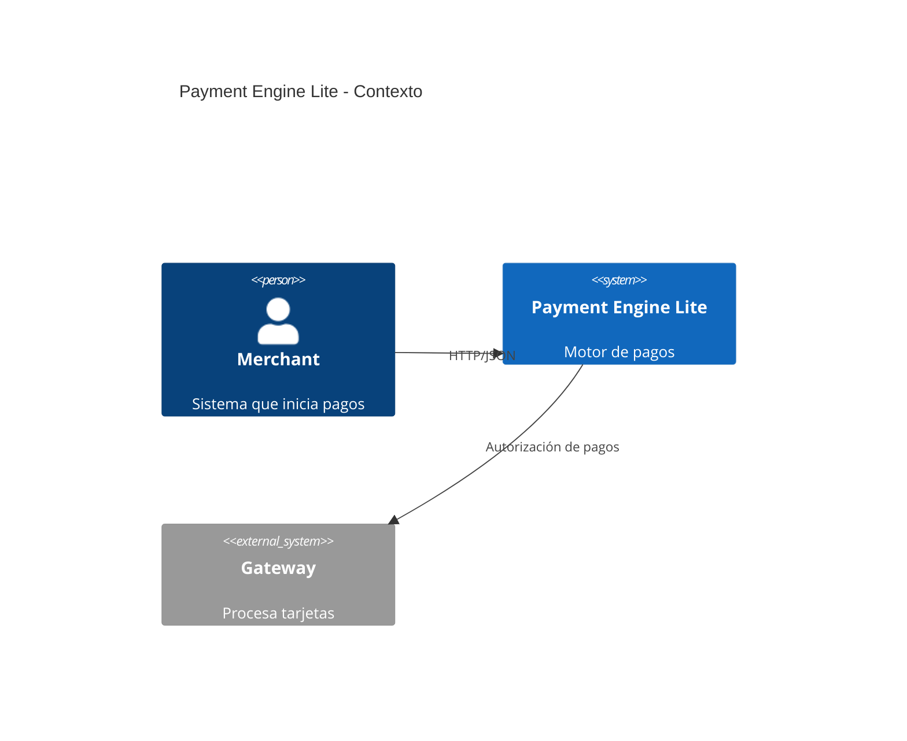
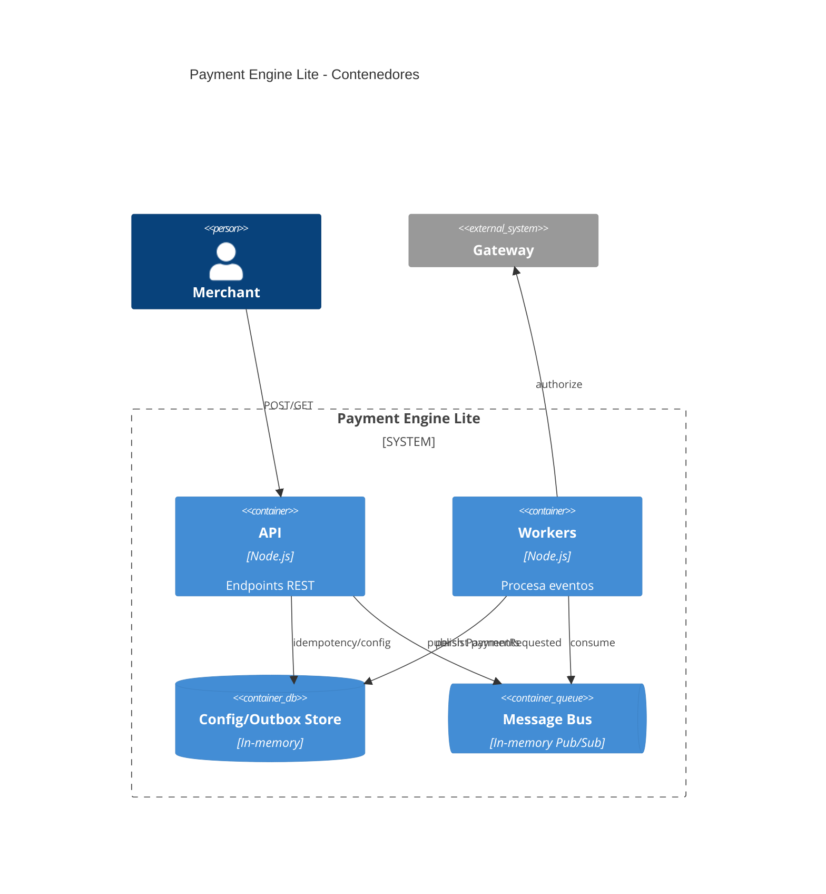
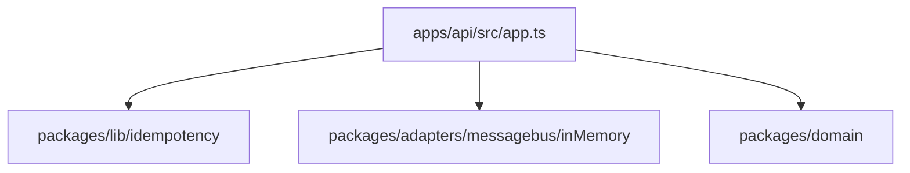

# Arquitectura

## Modelo C4

### Contexto


### Contenedores


### Componentes (API)
```mermaid
C4Component
    title API - Componentes
    Container(api, "API")
    Component(ctrl, "Controladores HTTP")
    Component(idem, "Middleware Idempotencia")
    Component(domain, "Validaciones Dominio")
    Rel(ctrl, idem, "verifica claves")
    Rel(ctrl, domain, "valida payloads")
    Rel(ctrl, "MessageBus", "publica eventos")
```

### Código


## Decisiones Arquitectónicas Clave (ADR)
1. **Node.js + TypeScript** por productividad y ecosistema.
2. **Hexagonal (Ports & Adapters)** para aislar el dominio.
3. **CloudEvents 1.0** como contrato de eventos asíncronos.
4. **OpenTelemetry** para trazas y métricas portables.
5. **Adapters en memoria** en el MVP; reemplazables por servicios gestionados.
