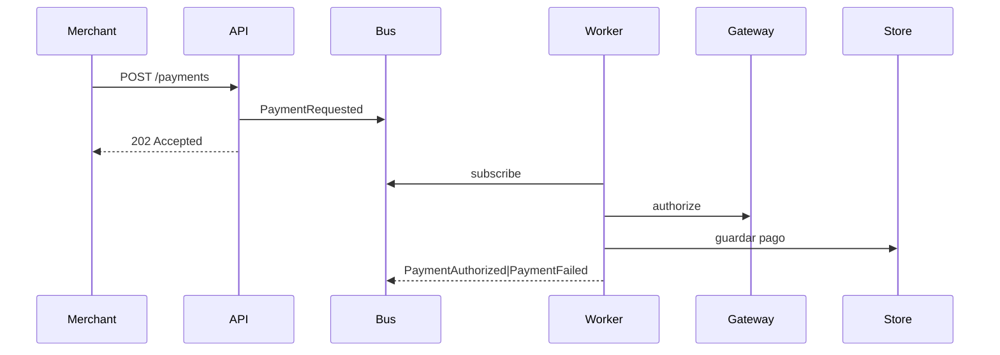
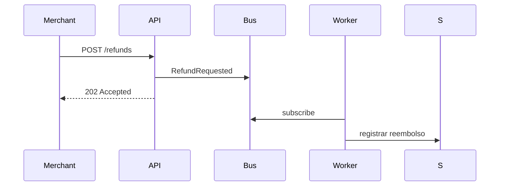

# Flujos de Negocio

## Procesar pago (modo async)

```mermaid
sequenceDiagram
    participant M as Merchant
    participant API
    participant Bus
    participant W as Worker
    participant G as Gateway
    participant S as Store
    M->>API: POST /payments
    API->>Bus: PaymentRequested
    API-->>M: 202 Accepted
    W->>Bus: subscribe
    W->>G: authorize
    W->>S: guardar pago
    W-->>Bus: PaymentAuthorized|PaymentFailed
```

## Reembolso

```mermaid
sequenceDiagram
    participant M as Merchant
    participant API
    participant Bus
    participant W as Worker
    M->>API: POST /refunds
    API->>Bus: RefundRequested
    API-->>M: 202 Accepted
    W->>Bus: subscribe
    W->>S: registrar reembolso
```
